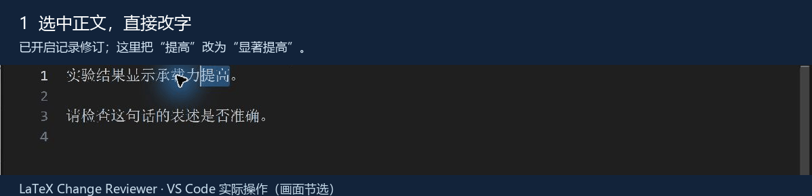
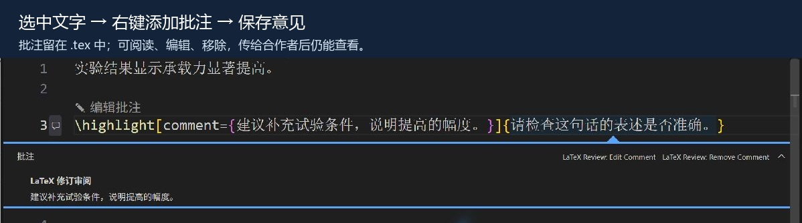
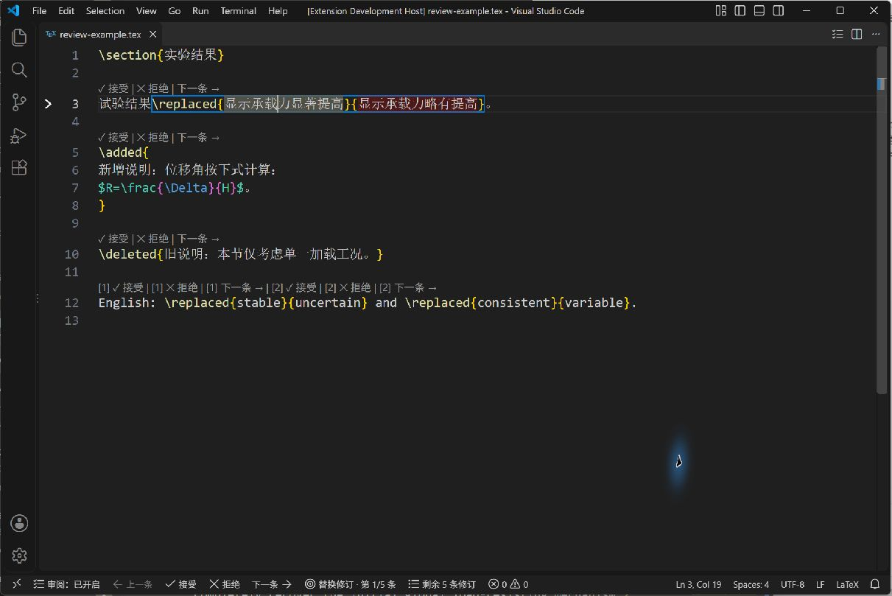
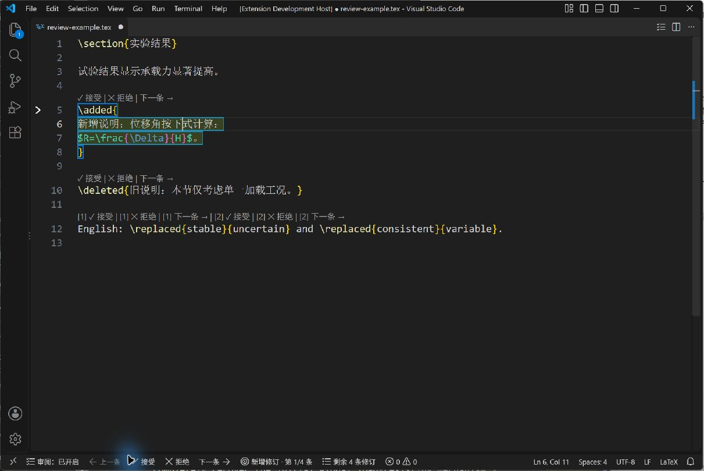

# LaTeX Change Reviewer — VS Code 的 LaTeX 审阅插件

**像 Word 一样提出修改、留下批注，在 VS Code 里逐条接受或拒绝 LaTeX 修订。**

LaTeX Change Reviewer 是一个 **VS Code 插件**。写作者开启“记录修订”，直接改正文，插件自动留下新增、删除和替换标记；审阅者开启“审阅工具”，对照新旧文字，点击接受或拒绝，再看下一条。选中文字后右键即可添加批注，给合作者说明修改理由。

它把熟悉的 **“修改并留痕 → 批注说明 → 逐条确认”** 流程带到 LaTeX 源码编辑器。你不必为普通正文修改手写修订命令，也不必在接受修改时逐一拆掉包装。修订和批注都留在 `.tex` 中，已有的 changes 文稿也能继续使用。

**推荐直接在 VS Code 扩展面板搜索安装。** 已上架 [VS Code 扩展市场](https://marketplace.visualstudio.com/items?itemName=Unfinished-draft.latex-change-reviewer)，可直接搜索 LaTeX Change Reviewer 安装。发布者：Unfinished draft。

## 0.3.0：像平常一样修改，再像 Word 一样逐条审阅

### 直接编辑，修改自动留下记录

打开**记录修订**后，照常在 `.tex` 源码里输入、删除、粘贴或替换文字，插件会把这些编辑记为 LaTeX 修订。你不需要自己输入或整理 `\added`、`\deleted`、`\replaced` 命令；也可以给选中文字或修订添加批注。



### 对照修订，逐条决定接受或拒绝

打开**审阅工具**后，可查看每条修订，点击**接受**或**拒绝**，再继续到下一条；也可以添加、阅读和管理批注。操作方式接近 Word 的逐条审阅流程，决定会直接更新 `.tex` 源码，点错可用 `Ctrl+Z` 撤销。



两个开关彼此独立：**审阅工具**显示查看、接受、拒绝、导航和批注操作；**记录修订**把当前文件之后的编辑记为修订。关闭一个不会影响另一个。审阅工具会记住工作区状态；记录修订仅对当前文件和本次会话有效，默认关闭。

要记录修改，打开 `.tex` 文件，点击左下角的**记录修订**即可开启；再次点击即可关闭。添加批注时先开启**审阅工具**，然后在正文中右键操作。

在正文中选中文字后，右键选择**添加批注**，即可为选区或现有修订写下意见；没有选区时可以添加独立批注。批注支持悬停阅读、编辑、移除和导航，每个目标保存一条意见。接受或拒绝带批注的修订时，意见会随该修订一起移除；移除普通文字上的批注会保留文字。

记录修订适用于单光标正文和边界完整的常见引用、行内公式。导言区、命令定义、注释、代码环境、修订旧文本及跨结构编辑不会自动记录。无法安全转换的编辑会保留在文档中并暂停记录；可查看差异、撤销，或从当前内容重新开启记录。中文和日文输入法组合期间保持原生输入，确认或取消后再记录。

已知限制：输入法组合未完成时快速切换系统输入法，可能导致记录暂停并留下未标记的原生输入；切换前请先确认或取消组合。与接管键入的其他扩展尚未验证兼容性。若文件在编辑过程中变为只读，可通过提示查看并复制未写入的输入。

除直接编辑外，命令面板也提供主动标记新增、删除、替换及合并所选相邻修订。合并仅适用于同类型、同作者、无批注且没有结构边界的相邻修订。记录所用的输入命令仅在开启记录时转交；关闭后恢复 VS Code 的普通编辑操作。

作者标记可通过 `latexReview.authorId` 设置为文档已有的 `changes` 作者 ID。编译时请在导言区加载 `\usepackage{changes}`；使用作者 ID 时还需配置 `\definechangesauthor{你的ID}{...}`。插件不会自动修改导言区；不设置作者也可以使用。

## 它怎样帮助你审阅

- **用鼠标逐条决定。** 修订上方显示“接受｜拒绝｜下一条”，底部还有固定操作条，不必反复寻找按钮。
- **看清正在审阅什么。** 当前修订带有箭头和边框，新旧文本以不同底色区分，悬停可查看说明；底部显示当前序号与剩余数量。
- **连贯地检查修改。** 接受或拒绝后自动进入下一条，也可以随时回到上一条。到文件末尾时停止，不会自动绕回开头。
- **点错可以撤销。** 每次决定都能单独用 Ctrl+Z 恢复。插件保留原有换行和空格，不会自动排版或保存文档。
- **按你的习惯使用。** 支持简体中文、English、日本語，可随时开启或关闭审阅，也可以使用辅助快捷键。

插件在本地工作，不会上传文稿。不需要账号、LaTeX Workshop 或 TeX 编译环境。免费使用，采用 [MIT 许可](LICENSE)。



**同一行有多处修订时怎么看按钮？** 插件会在每组按钮前显示 `[1]`、`[2]` 等编号，按这一条源码行中修订出现的先后顺序区分目标。例如，`[1] 接受` 处理第一处修订，`[2] 拒绝` 处理第二处修订；编号相同的“下一条”从对应修订向后导航。即使光标在别处，点击按钮仍处理它对应的修订。文字因窗口宽度自动折成多行，仍属于同一条源码行。这里的编号只用于当前行，处理修订后会重新排列，不是全文修订序号，也不会写入文稿。

## 安装后，三步开始

适用于 Windows 桌面版 **VS Code 1.85.2 或更高版本**。直接安装插件不需要 Node.js。

1. 在 VS Code 扩展面板（Ctrl+Shift+X）搜索 **LaTeX Change Reviewer**，确认发布者是 **Unfinished draft**，点击**安装**。也可以打开 [插件商店页面](https://marketplace.visualstudio.com/items?itemName=Unfinished-draft.latex-change-reviewer) 安装；精确搜索可输入 `@id:Unfinished-draft.latex-change-reviewer`。
2. 打开要审阅的 .tex 文件，点击编辑器右上角的**清单图标**，或左下角的**“审阅：已关闭”**，开启审阅。
3. 阅读当前修订的新旧文字，点击**接受**或**拒绝**，然后继续检查下一条。修订上方的按钮和底部固定操作条都可以使用。

再次点击清单图标或左下角的审阅开关即可关闭。开关状态会在当前工作区记住。关闭审阅只隐藏插件界面，不改变文稿。

你仍然可以照常编辑和保存文件。若 VS Code 本身开启了自动保存，保存行为仍由它的设置决定。需要撤销时按 Ctrl+Z；Windows 下可用 Ctrl+Y 重做。

需要离线安装时，可从 [GitHub 版本页](https://github.com/JIE-jiee/latex-change-reviewer/releases/latest) 下载文件名带 `-marketplace.vsix` 的正式安装包，然后在命令面板运行 **Extensions: Install from VSIX… / 扩展：从 VSIX 安装**。使用过程中遇到问题，可在 [问题反馈](https://github.com/JIE-jiee/latex-change-reviewer/issues) 中说明现象，并附上不含隐私内容的最小示例。

## 接受与拒绝会得到什么

插件使用 changes 宏包的标准顺序：**替换命令的新文本在前，旧文本在后。**

| 文档中的修订 | 点击接受 | 点击拒绝 |
|---|---|---|
| `\replaced{新文本}{旧文本}` | 保留新文本 | 恢复旧文本 |
| `\added{新增文本}` | 保留新增文本 | 移除这段新增内容 |
| `\deleted{旧文本}` | 删除旧文本 | 恢复旧文本 |

例如，文档里写着：

~~~latex
实验结果\replaced{显著提高}{略有提高}。
~~~

点击**接受**，得到“实验结果显著提高。”；点击**拒绝**，得到“实验结果略有提高。”。修改会真正写入编辑器中的源码，随后由你决定是否保存。



多行文字、公式和引用也可以一起审阅。插件精确保留所选文字的原始换行、缩进和空格，所以处理后可能仍有原来参数中的空行。

## 切换语言与调整操作方式

在命令面板搜索 **LaTeX Review**（菜单名称跟随 VS Code 显示语言），运行 **Select Interface Language / 选择界面语言**，选择简体中文、English、日本語或跟随 VS Code。

按钮、底部操作条和提示会立即切换；命令面板、右键菜单和设置说明跟随 VS Code 本身的显示语言。文稿内容不会被翻译。

在 VS Code 设置中搜索 latexReview，可以调整：

| 设置 | 默认行为 |
|---|---|
| `latexReview.autoGoToNext` | 接受或拒绝后自动进入下一条；可关闭 |
| `latexReview.highlightChanges` | 显示当前修订的边框和新旧文本底色；可关闭 |
| `latexReview.showReviewToolbar` | 显示底部固定操作条；可关闭 |
| `latexReview.uiLanguage` | 跟随 VS Code；可选 zh-CN、en、ja |
| `latexReview.authorId` | 默认为空；可填文稿已有的 changes 作者 ID |
| `latexReview.enableDefaultKeybindings` | 启用辅助快捷键；可关闭或自行改键。此设置不控制记录模式所需的退格、删除、粘贴和剪切转交键位 |

鼠标是主要操作方式。习惯键盘操作时，可先按 **Ctrl+K**，松开后再按以下组合：

| 第二组按键 | 操作 |
|---|---|
| Alt+A | 接受当前修订 |
| Alt+R | 拒绝当前修订 |
| Alt+N | 下一条 |
| Alt+P | 上一条 |
| Alt+T | 开启／关闭审阅 |

接受或拒绝当前修订时，把光标放在修订内部即可。底部修订类型与序号按钮可以把视图带回当前目标；剩余数量入口可以定位当前或附近的修订。右键菜单和命令面板也提供审阅操作。审阅工具关闭时，仍可单独开启记录修订；记录模式必要的原生命令转交不依赖审阅界面开关。

如果看不到修订上方的按钮，请检查 VS Code 的 **Editor: Code Lens** 是否开启，或直接使用底部操作条。快捷键仅在 LaTeX 编辑器获得焦点且未进行输入法组合输入时生效；其他扩展的键位可能需要自行协调。

## 哪些文档适合使用

插件适合在当前 LaTeX 文件中逐条检查 changes 风格的新增、删除和替换，支持多行文字、嵌套花括号、公式、引用、标准可选参数及中英日混合正文。注释、常见代码展示环境和常见命令定义中的修订文字会被忽略。

若修订中还嵌着另一条修订，先处理外层；保留下来的内层修订随后会出现。因此，剩余数量表示当前可以独立处理的条目，外层展开后数量可能增加。

无法确认范围的残缺修订会显示提示并保留原文；存在解析错误时，不会显示“完成”。只读文件可以查看，不能接受或拒绝。

目前只处理当前文件，不扫描整个项目，不提供一键接受全部，也没有 PDF 对照。自定义修订宏、复杂 TeX 条件及特殊宏展开不在支持范围内。移除修订标记可能影响某些 TeX 分组或命令衔接，遇到特殊写法时仍需检查结果。

首轮已在 Windows 桌面版 VS Code 验证；其他系统、Web 和 Remote 环境尚未验证。

## English quick start

**Word-style revision recording and comments for LaTeX, inside VS Code.** Edit your source normally to leave tracked changes, add a comment to explain your suggestion, then review each change with Accept, Reject, and Next. The extension generates standard changes macros and keeps your edits in the `.tex` file.

Install from the [VS Code Marketplace](https://marketplace.visualstudio.com/items?itemName=Unfinished-draft.latex-change-reviewer), or search **LaTeX Change Reviewer** in Extensions and choose publisher **Unfinished draft**. Open a .tex file and click the checklist icon to start reviewing. For offline installation, use the `-marketplace.vsix` file from [Releases](https://github.com/JIE-jiee/latex-change-reviewer/releases/latest). The extension is free to use under the MIT license; the source is public on GitHub. Use `\replaced{new}{old}`. Ctrl+Z undoes each decision. Choose **Select Interface Language** to switch languages.

Version 0.3.0 adds optional revision recording and comments. Turn on **Track changes** to edit in the source editor and record additions, deletions, and replacements as `\added{new}`, `\deleted{old}`, and `\replaced{new}{old}`. Turn on **Review Tools** to inspect, accept, reject, navigate, and comment on changes. The switches work independently; recording is off by default and applies to the current file for this session.

Select text and choose **Add Comment** from the context menu to attach a comment to the selection or a revision. With no selection, the extension inserts a standalone comment. Comments can be read on hover, edited, removed, and navigated. There is one comment per target, with no reply threads. Accepting or rejecting a commented revision removes its comment; removing a comment from ordinary text preserves the text.

Recording supports single-cursor body edits and complete, common references and inline math. It does not automatically record edits to the preamble, definitions, comments, code environments, old branches of revisions, or edits across structural boundaries. If an edit cannot be converted safely, the text is kept and recording pauses; inspect the diff, undo, or resume from the current text. Chinese and Japanese IME input stays native until composition is confirmed or cancelled.

Known limits: switching system input methods before composition finishes may pause recording and leave native, unmarked text. Confirm or cancel composition before switching. Compatibility with other extensions that take over typing has not been verified. If the document becomes read-only during an edit, the notice lets you view and copy input that could not be written.

## 日本語クイックスタート

**Word に慣れた変更記録とコメントの流れを、VS Code の LaTeX 編集で。** 本文を直接編集して修正を残し、コメントで意見を伝え、新旧の文章を見比べて「承認」「却下」「次へ」で一件ずつ確認できます。修正とコメントは標準的な changes コマンドとして `.tex` に保存されます。

[VS Code Marketplace](https://marketplace.visualstudio.com/items?itemName=Unfinished-draft.latex-change-reviewer) からインストールできます。拡張機能で **LaTeX Change Reviewer** を検索し、発行者 **Unfinished draft** を選んでください。オフラインの場合は [Releases](https://github.com/JIE-jiee/latex-change-reviewer/releases/latest) の `-marketplace.vsix` を使用できます。.tex を開き、チェックリストアイコンでレビューを開始してください。MIT ライセンスで無料で利用でき、ソースは GitHub で公開されています。`\replaced{新しい文}{元の文}` の順で指定します。Ctrl+Z で操作ごとに元に戻せます。表示言語は言語選択コマンドから切り替えられます。

バージョン 0.3.0 では、修正の記録とコメントに対応しました。**変更記録**をオンにしてソースを編集すると、追加・削除・置換を `\added{新しい文}`、`\deleted{元の文}`、`\replaced{新しい文}{元の文}` として記録します。**レビュー ツール**をオンにすると、修正の確認、承認、却下、移動、コメントができます。2 つのスイッチは独立しており、記録は既定でオフ、現在のファイルとセッション内で有効です。

文字を選択して右クリックし、**コメントの追加**を選ぶと、選択範囲または修正にコメントを付けられます。選択範囲がない場合は独立したコメントを追加します。コメントはホバーで読めるほか、編集、削除、移動ができます。各対象につきコメントは 1 件で、返信スレッドには対応していません。コメント付き修正を承認または却下するとコメントも削除されます。通常の文章からコメントだけを削除した場合、文章は残ります。

記録機能は、単一カーソルでの本文編集と、構造が完結した一般的な参照・インライン数式に対応します。プリアンブル、定義、コメント、コード環境、修正前の文章、構造境界をまたぐ編集は自動記録しません。安全に変換できない場合は入力を残して記録を一時停止します。差分を確認して元に戻すか、現在の内容から記録を再開してください。中国語・日本語 IME は入力確定または取消まで標準処理されます。

既知の制限：IME の入力確定前にシステム入力方式を素早く切り替えると、記録が一時停止し、IME 標準の未記録文字が残る場合があります。切り替える前に入力を確定または取り消してください。入力を引き継ぐ他の拡張機能との互換性は未確認です。編集中に読み取り専用へ変わった場合は、通知から書き込めなかった入力を確認・コピーできます。

<details>
<summary>开发：从源码运行、测试与打包</summary>

### 从源码运行

```text
src/                 扩展入口、解析与类型、审阅／导航、修订记录、批注及文本转换、动态三语
tests/               解析／导航单元测试、VS Code 集成测试与启动器
.vscode/             F5 启动配置和编译任务
package*.json        清单、依赖锁与静态中英日文案
artifacts/           可安装 VSIX
.cache/              npm 缓存、隔离 VS Code 测试环境和临时文件
PLAN.md              确认目标与验收进度
```

需要 Node.js 20 或更高版本及 VS Code 1.85.2 或更高版本。开发命令从本项目目录执行，不使用全局安装：

```powershell
New-Item -ItemType Directory -Force .cache/tmp, artifacts | Out-Null
$env:TEMP = Join-Path $PWD '.cache/tmp'
$env:TMP = $env:TEMP
npm.cmd ci --cache .cache/npm --no-audit --no-fund
npm.cmd test
```

打开本项目，按 **F5** 启动 Extension Development Host；使用项目内隔离 profile 和扩展目录，不修改日常 VS Code。打开测试 `.tex` 文件并开启审阅即可。

集成测试（自动启动隔离 VS Code）：

```powershell
# 使用本机 VS Code，路径按实际安装位置填写
$env:REVIEW_CODE_EXECUTABLE = '<VS Code 安装路径>\Code.exe'
npm.cmd run test:integration

# 留空 executable，并指定版本，可下载隔离版本进行兼容测试
Remove-Item Env:REVIEW_CODE_EXECUTABLE -ErrorAction SilentlyContinue
$env:REVIEW_CODE_VERSION = '1.85.2'
npm.cmd run test:integration
```

打包：

```powershell
npm.cmd run package
```

得到 `artifacts/latex-change-reviewer-<版本>.vsix`（例如 `latex-change-reviewer-0.3.0.vsix`）。产物版本从 `package.json` 读取。此包用于开发测试；日常用户请从扩展市场安装。开发依赖、缓存和测试文件不包含在安装包中。安装包也可从 [GitHub Releases](https://github.com/JIE-jiee/latex-change-reviewer/releases) 下载。插件已上架 [VS Code 扩展市场](https://marketplace.visualstudio.com/items?itemName=Unfinished-draft.latex-change-reviewer)，发布者为 Unfinished draft（Unfinished-draft）；采用 MIT 许可，源码公开。常规打包使用本地开发身份，日常安装和分享请使用商店版本或正式身份安装包。


### 准备商店安装包

[商店页面预览](media/store/preview.html) 与 [上架字段](media/store/listing.json) 可用于核对介绍、图标和截图。常规 `npm run package` 生成可试装的预览包，仍使用开发身份。已注册发布者 Unfinished draft（ID：`Unfinished-draft`）。生成正式身份的安装包可运行：

```powershell
npm.cmd run package:marketplace -- --publisher Unfinished-draft
```

此命令只在打包暂存区替换发布者 ID，生成名称带 `-marketplace` 的安装包，不执行发布。通过 [Marketplace 管理页面](https://marketplace.visualstudio.com/manage) 上传前，应核对正式发布者、版本及商店内容。

### 支持细节与验证

记录模式按条件转交普通输入、删除、粘贴及剪切命令，使修订包装和正文进入同一撤销步骤。IME 组合期间保持原生处理，明确结束后转换；500 ms 调度不用于判定输入法是否完成。无法识别的外部修改保留原文结果并暂停。未闭合公式、注释或定义中的伪正文起点不会被当作安全的正文范围。

解析支持 CRLF、参数间注释、转义百分号与花括号、标准可选参数；忽略 \verb、\verb*、verbatim、verbatim*、lstlisting、minted 和常见 \newcommand、\renewcommand、\providecommand、\DeclareRobustCommand 定义。不展开 \def、xparse、自定义宏、复杂条件或字符类别变化。

0.3.0 已通过 38 项自动测试，以及 VS Code 1.85.2 与 1.139.1 的源码和安装包集成测试。隔离窗口中已实际验证中日文输入法、修订记录、批注保存与撤销。尚未验证使用者真实文稿中的特殊宏工作流。

</details>
